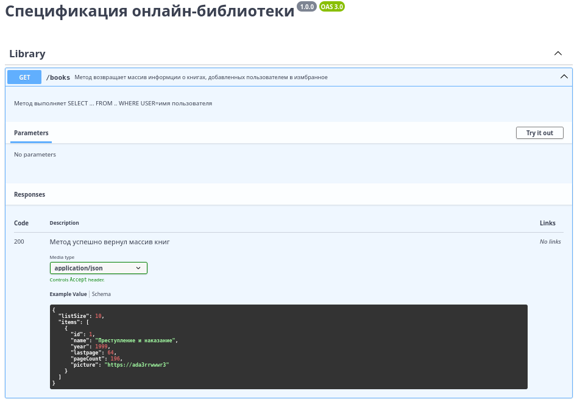
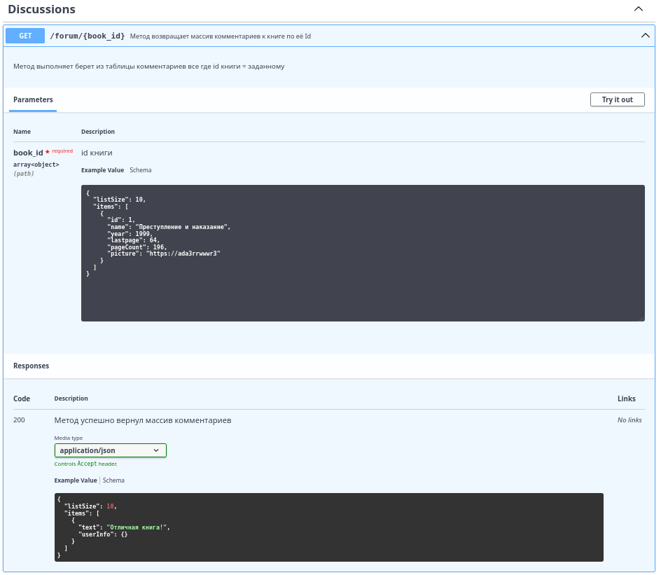
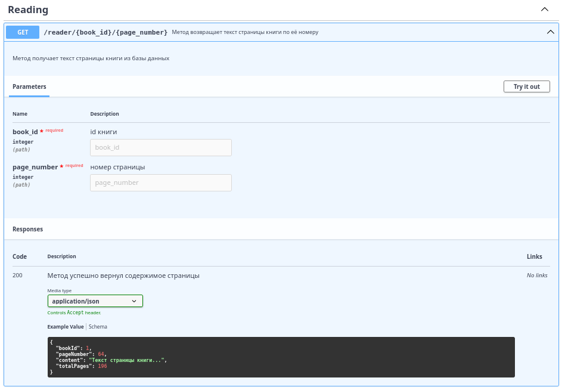
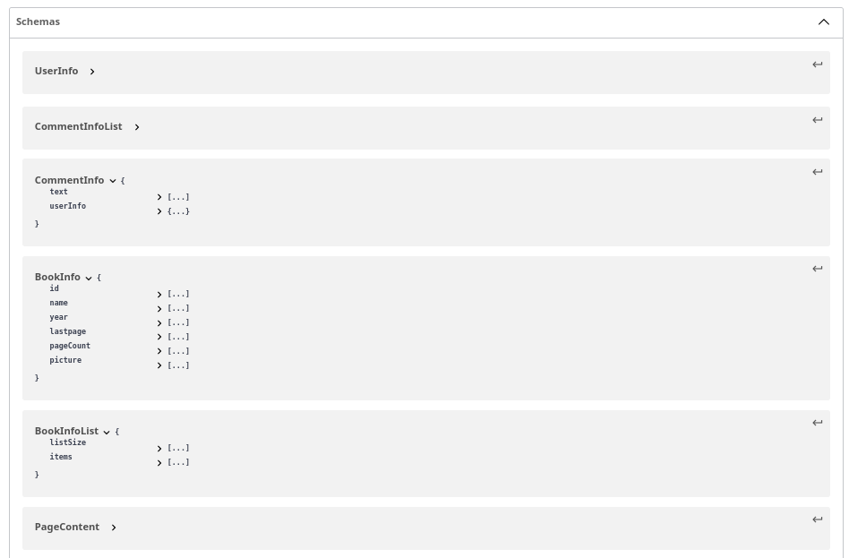

# machine
Реализовали классы Printer и StringSummer, а также . 

Все настройки сборки проекта в build.gradle.

Python скрипт находится в scripts/collaborators_info.py

ui тесты включены в этап с юнит тестированием

к репозиторию подлючен [github projects](https://github.com/users/drgon-dev/projects/2)

# ui интеграционные тесты

## 

# swagger и фронтенд

## 

## Экран 1: «Моя библиотека» (My Library)

Личная коллекция книг пользователя: текущие, прочитанные, отложенные.
### Визуальный дизайн:
Вкладки: «Читаю сейчас», «Моя библиотека»

В «Читаю сейчас»: крупная карточка текущей книги с прогресс-баром (% прочтения), кнопкой «Продолжить».

Сетка книжных обложек для других вкладок.

Данные из API (пользовательский каталог + метаданные):

Метаданные книг в библиотеке: массив объектов, каждый содержит:

**book_id, name, year , picture_url, laspage, pageCount**

Данные локально (состояние чтения и настройки):

Текущая позиция чтения для каждой книги (номер страницы, процент). Синхронизируется с сервером периодически, но при офлайн-чтении сохраняется и обновляется только локально.

## Экран 2: «Читалка» (Reader)

Экран непосредственно для чтения книги.

### Визуальный дизайн:

Минималистичный интерфейс. Основное пространство — текст + номер страницы внизу.

Панель управления (по тапу): настройки шрифта, темы.

Данные из API (контент книги и синхронизация):

Текст книги (главы): загружается постранично по мере необходимости (с предзагрузкой).

Текущая позиция в тексте (номер страницы, скролл) — постоянно обновляется локально.

Настройки отображения:

**font_size, font_family**

**theme (дневная/ночная/сепия)**

Эти настройки хранятся локально и применяются мгновенно.

## Экран 3: «Книжный клуб / Обсуждения» (Book Club)

### Визуальный дизайн:

Вкладки: «Рецензии».

Карточка рецензии: аватар, имя, текст

Данные из API (динамический социальный контент):

Массив рецензий на данную книгу.

Данные локально:

Черновик собственной рецензии или комментария (сохраняется локально до отправки).