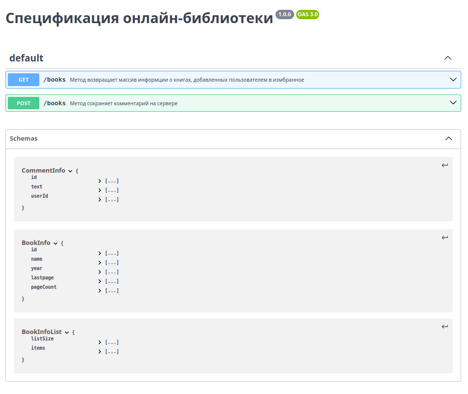
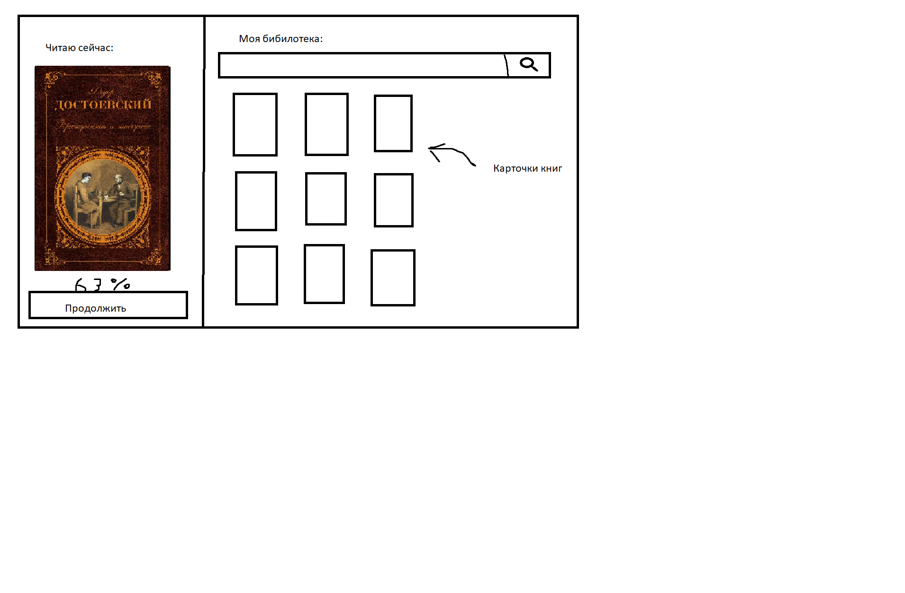
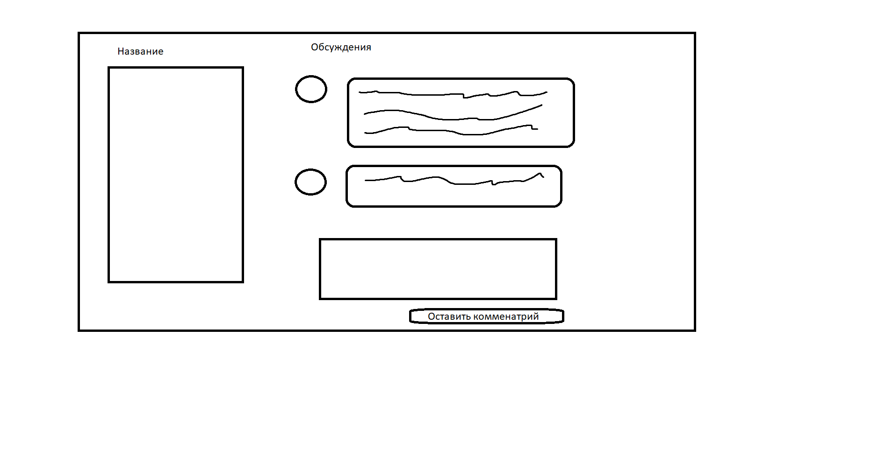

# machine
Реализовали классы Printer и StringSummer, а также pipeline (.github/workflows/deployment.yaml). 

Все настройки сборки проекта в build.gradle.

Python скрипт находится в scripts/collaborators_info.py

ui тесты включены в этап с юнит тестированием

к репозиторию подлючен [github projects](https://github.com/users/drgon-dev/projects/2)
# swagger и фронтенд

## Экран 1: «Моя библиотека» (My Library)

Личная коллекция книг пользователя: текущие, прочитанные, отложенные.
### Визуальный дизайн:
Вкладки: «Читаю сейчас», «Моя библиотека»

В «Читаю сейчас»: крупная карточка текущей книги с прогресс-баром (% прочтения), кнопкой «Продолжить».

Сетка книжных обложек для других вкладок.

Сбоку фильтр: «По автору», «По дате добавления», «По рейтингу».

Данные из API (пользовательский каталог + метаданные):

Метаданные книг в библиотеке: массив объектов, каждый содержит:

**book_id, title, author, cover_image_url, genre, total_pages**

**user_progress: current_page, last_read_date**

**user_rating (оценка 1-5)**

**user_status (reading, planned, finished)**

**added_to_library_date**

Данные локально (состояние чтения и настройки):

Текущая позиция чтения для каждой книги (номер страницы, процент). Синхронизируется с сервером периодически, но при офлайн-чтении сохраняется и обновляется только локально.

Последний открытый раздел/вкладка в библиотеке.

Порядок сортировки и фильтры (выбранные жанры для отображения).

Локальный кэш обложек книг для офлайн-доступа к библиотеке.

Локальные пометки (например, временные закладки), еще не сохраненные в «облако».

## Экран 2: «Читалка» (Reader)

Экран непосредственно для чтения книги.

### Визуальный дизайн:

Минималистичный интерфейс. Основное пространство — текст.

Панель управления (по тапу): настройки шрифта, темы, переход к главе, поиск по тексту.

Вверху: время, название книги.

Внизу: номер страницы, прогресс-бар, кнопка добавления закладки/выделения.

Данные из API (контент книги и синхронизация):

Текст книги (главы): загружается постранично или по главам по мере необходимости (с предзагрузкой).

Облачные аннотации и закладки: выделения, заметки на полях, созданные пользователем и синхронизированные между его устройствами.

Популярные цитаты (подсветка от других читателей, если разрешено).

Данные локально (все, что касается процесса чтения и локального форматирования):

Текущая позиция в тексте (номер страницы, скролл) — постоянно обновляется локально.

Настройки отображения:

**font_size, font_family**

**theme (дневная/ночная/сепия)**

**line_height, margins**

Эти настройки хранятся локально и применяются мгновенно.

Несинхронизированные выделения/заметки, сделанные офлайн.

Локальный кэш загруженных глав книги для чтения без интернета.

История поиска по тексту внутри книги.

## Экран 3: «Книжный клуб / Обсуждения» (Book Club)

Социальный экран: рецензии, обсуждения книг, читательские клубы.

### Визуальный дизайн:

Лента активностей: друзья закончили книгу, добавили рецензию.

Вкладки: «Рецензии» (с агрегацией оценок), «Обсуждения» (топики по книгам), «Клубы» (сообщества).

Карточка рецензии: аватар, имя, оценка, текст, цитата из книги.

Данные из API (динамический социальный контент):

Рецензии и оценки на книгу: массив от пользователей и критиков.

Обсуждения (топики):

**thread_id, title, author, post_count, last_activity**

Список читательских клубов:

**club_id, name, topic, member_count, next_meeting_date**

Активности друзей: 

**массив событий (user_id, action — «оценил», «закончил», book_id, timestamp)**

Данные локально (персональные социальные настройки):

Состояние «лайка» на рецензии (оптимистичный апдейт).

Черновик собственной рецензии или комментария (сохраняется локально до отправки).

Свернутые/развернутые ветки обсуждений.

Настройки уведомлений для клубов (notify_new_posts, notify_meeting_reminder) — могут храниться локально, так как влияют только на это устройство.

Список «скрытых» топиков или клубов, которые пользователь не хочет видеть.

